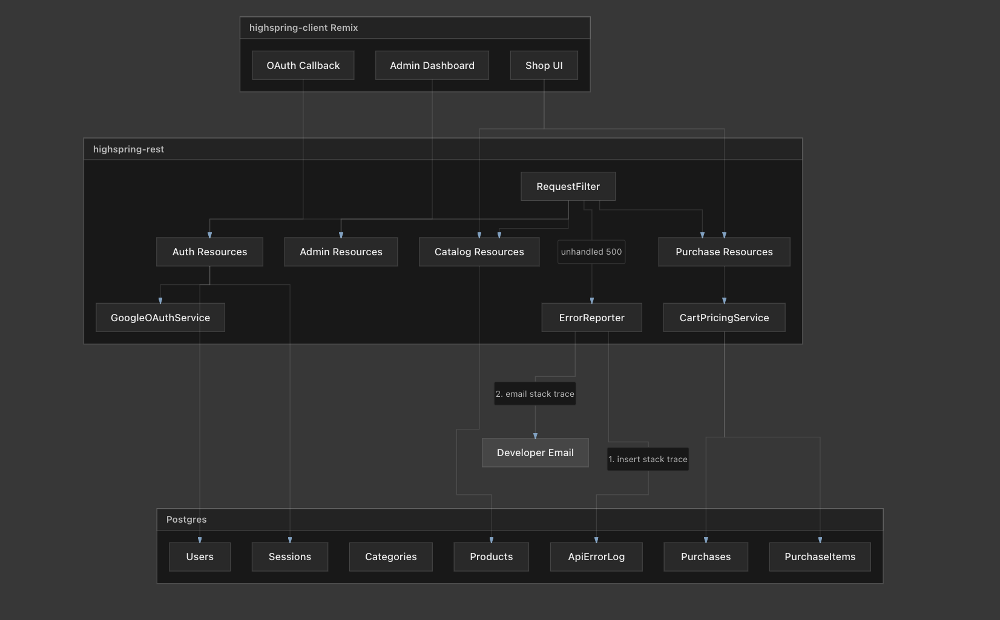

# Architecture guide

Prefer the **JavaDoc on the classes** for details — this page is the map.

## Big picture

```
Remix client (port 3000)
    │  Authorization: session:{uuid}
    ▼
Jetty API (port 8090)
    RequestFilter  →  RootResource  →  Version1Resource  →  leaf resource
    │
    ├── database module (Flyway + JOOQ)
    ├── domain module (JSON DTOs)
    └── common module (config, mail, error reporting)
```

URLs are matched by walking a tree of `AbstractResource` subclasses.



## Read these classes first

| Order | Class | Why |
|------:|-------|-----|
| 1 | `api.resource.package-info` | Explains the whole HTTP chain |
| 2 | `RequestFilter` | Front door: route + exception policy |
| 3 | `RootResource` | `/` and how versioning starts |
| 4 | `Version1Resource` | **Route table** for `/v1/…` |
| 5 | `AbstractResource` | `getByPath`, auth helpers, verb dispatch |
| 6 | `Server` | Process boot |
| 7 | `HttpStatusGuide` | REST HTTP status / error codes |

## How `/v1/cart/` is found

1. Filter extracts path `v1/cart/`
2. `new RootResource(scope).getByPath("v1/cart/")`
3. Root delegates to `Version1Resource` (`v1/`)
4. Version1 delegates to `CartResource` (`cart/`)
5. `CartResource.httpGet()` runs

Adding an endpoint = new resource class + register it in the parent’s `getDescendantByPath`.

## Calling the API from outside Remix

- Auth header and login steps: [AUTH.md](AUTH.md)
- Importable Postman collection: [postman/Highspring_API.postman_collection.json](postman/Highspring_API.postman_collection.json)

## Browser security (simple)

| Concern | Where | What we do |
|---------|-------|------------|
| **CORS** | API `RequestFilter` | Allowlist from `CORS_ORIGINS` (e.g. `http://localhost:3000`); credentials only for matched origins |
| **CSP** | Remix `root.tsx` headers | Restrict scripts/styles/frames to `'self'` (+ Google Fonts / https images) |
| **CSRF** | Remix session cookie | `SameSite=Lax` + mutations via POST; API uses `Authorization` header (not a cookie), so cross-site pages cannot forge API calls with the bearer token |
| **Logout** | `DELETE /v1/auth/logout/` | Deletes `api_session` before clearing the Remix cookie |

## Errors

- Expected client mistakes → 4xx, **not** stored in `api_error_log`
- Unexpected crashes → 500 + full stack in DB + developer email

Full table: Java class `HttpStatusGuide` (also on the Javadoc overview). Admins can open published docs at `/admin/javadoc/` after `mvn javadoc:aggregate`.

See `docs/DECISIONS.md` for ACID checkout, cart persistence, and related choices.
